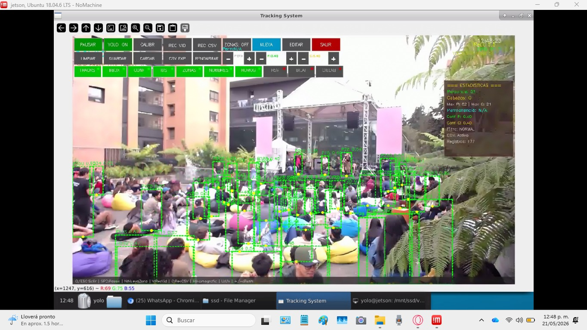

### Hey there, Juan Carlos Bobadilla is the name 
Electronic engineer from the Pontificia Universidad Javeriana-Investigating abandonware, Hardware solutions,AI models and Computer Vision applications

Latest project: S.E.I.T.R.A.C (Honors Distinction for Undergraduate Thesis): YOLO and NVIDIA Jetson TX2-Based People Counting and Occupancy Monitoring System.

<!--
**JCBS-ielec/JCBS-ielec** is a ✨ _special_ ✨ repository because its `README.md` (this file) appears on your GitHub profile.

Here are some ideas to get you started:

- 🔭 I’m currently working on ...
- 🌱 I’m currently learning ...
- 👯 I’m looking to collaborate on ...
- 🤔 I’m looking for help with ...
- ⚡ Fun fact: ...
-->
